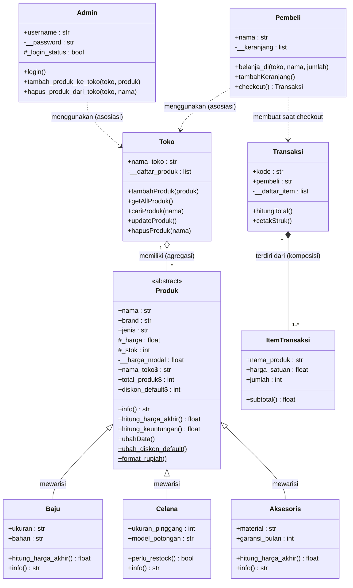

# Posttest 2 PBO: Sistem Toko Baju Brand

> **Nama:** Bintang Dhana Permadi
> **NIM:** 2509106014
> **Kelas:** A'25

Posttest ini adalah lanjutan dari Posttest 1 (Toko Baju Brand). Fokusnya ada dua hal:

1. **Relasi UML**: Asosiasi, Agregasi, Komposisi
2. **Inheritance**: Superclass, Subclass, `super()`, atribut tambahan, method overriding, serta atribut protected dan private

File program: `posttest2.py`

---

## 1. Diagram UML



---

## 2. Penerapan Relasi UML

| Relasi | Class | Kata kunci | Letak di kode |
|---|---|---|---|
| **Asosiasi** | `Admin` → `Toko` | "menggunakan" | `Admin.tambah_produk_ke_toko(toko, produk)` dan `hapus_produk_dari_toko(toko, nama)` |
| **Asosiasi** | `Pembeli` → `Toko` | "menggunakan" | `Pembeli.belanja_di(toko, namaProduk, jumlah)` |
| **Agregasi** | `Toko` ◇— `Produk` | "memiliki" | `Toko.__daftar_produk` dan `Toko.tambahProduk(produk)` |
| **Komposisi** | `Transaksi` ◆— `ItemTransaksi` | "terdiri dari" | `Transaksi.__init__()` membuat `ItemTransaksi` langsung di dalamnya |

### a. Asosiasi (Admin dan Pembeli menggunakan Toko)

Objek `Toko` hanya diterima lewat **parameter method** dan **tidak disimpan** sebagai atribut. Kedua objek hidup sendiri-sendiri.

```python
class Admin:
    def tambah_produk_ke_toko(self, toko, produk):   # toko = parameter
        ...
        toko.tambahProduk(produk)

class Pembeli:
    def belanja_di(self, toko, namaProduk, jumlah=1):   # toko = parameter
        produk = toko.cariProduk(namaProduk)
        ...
```

### b. Agregasi (Toko memiliki Produk)

`Produk` **dibuat di luar** `Toko`, lalu dikirim ke `Toko` dan ditampung dalam list. Jika `Toko` dihapus atau produk dikeluarkan dari toko, objek `Produk` tetap ada.

```python
baju2 = Baju("Jaket H&M", ...)            # dibuat di luar Toko
toko_sementara = Toko("... - Bontang")
toko_sementara.tambahProduk(baju2)
del toko_sementara                        # Toko dihapus
print(baju2.info())                       # Produk masih utuh
```

### c. Komposisi (Transaksi terdiri dari ItemTransaksi)

`ItemTransaksi` **dibuat langsung di dalam** `Transaksi.__init__()`, tidak dibagi ke objek lain, dan ikut musnah bersama `Transaksi`. Di program ini dibuktikan dengan `weakref`: setelah `del trx2`, referensi item menjadi `None`.

```python
class Transaksi:
    def __init__(self, pembeli, daftar_item):
        self.__daftar_item = [
            ItemTransaksi(produk.nama, produk.hitung_harga_akhir(), jumlah)
            for produk, jumlah in daftar_item
        ]
```

---

## 3. Penerapan Inheritance

Jenis inheritance yang dipakai adalah **Hierarchical Inheritance** (satu superclass diwarisi beberapa subclass). Uji "is-a": Baju adalah Produk, Celana adalah Produk, Aksesoris adalah Produk, ketiganya masuk akal.

```
          Produk (Superclass / abstract)
         /        |         \
      Baju     Celana    Aksesoris   (Subclass)
```

| Ketentuan | Penerapan |
|---|---|
| **1 Superclass** | `Produk` |
| **Min. 2 Subclass** | `Baju`, `Celana`, `Aksesoris` (ada 3) |
| **`super().__init__(...)`** | Dipanggil di konstruktor ketiga subclass |
| **Atribut tambahan (unik)** | `Baju`: `ukuran`, `bahan` · `Celana`: `ukuran_pinggang`, `model_potongan` · `Aksesoris`: `material`, `garansi_bulan` |
| **Method overriding** | `info()` di-override oleh ketiga subclass (memanggil `super().info()` lalu menambah info khusus). `hitung_harga_akhir()` di-override oleh `Baju` (diskon default) dan `Aksesoris` (biaya kemasan), sedangkan `Celana` memakai versi `Produk`. |
| **Protected (`_`)** | `_harga` dan `_stok` di `Produk`, dipakai langsung oleh subclass |
| **Private (`__`)** | `__harga_modal` di `Produk`, rahasia dan hanya dipakai method milik `Produk` |

### a. Superclass dan `super().__init__()`

```python
class Produk(ABC):
    def __init__(self, nama, brand, jenis, harga, stok, harga_modal=0):
        self.nama = nama
        self.brand = brand
        self.jenis = jenis
        self.harga = harga                 # setter -> _harga (protected)
        self.stok = stok                   # setter -> _stok  (protected)
        self.__harga_modal = harga_modal   # private

class Baju(Produk):
    def __init__(self, nama, brand, harga, stok, harga_modal, ukuran, bahan):
        super().__init__(nama, brand, "Baju", harga, stok, harga_modal)
        self.ukuran = ukuran      # atribut unik Baju
        self.bahan = bahan        # atribut unik Baju
```

### b. Method Overriding

```python
# Produk (superclass)
def hitung_harga_akhir(self):
    return self._harga

# Baju (subclass) -> perilaku berbeda: kena diskon default toko
def hitung_harga_akhir(self):
    potongan = self._harga * Produk.diskon_default / 100
    return self._harga - potongan

# Aksesoris (subclass) -> perilaku berbeda: ditambah biaya kemasan
def hitung_harga_akhir(self):
    return self._harga + Aksesoris.biaya_kemasan_hadiah
```

Method `hitung_harga_akhir()` ini juga dipakai oleh `Transaksi`, jadi harga di struk otomatis menyesuaikan jenis produk (polymorphism).

### c. Protected dan Private pada Pewarisan

- **Protected** (`_harga`, `_stok`): subclass perlu mengaksesnya. `Baju` memakai `_harga` untuk menghitung diskon, dan `Celana.perlu_restock()` memakai `_stok`.
- **Private** (`__harga_modal`): harga modal adalah data rahasia toko. Subclass dan kode di luar class tidak bisa mengaksesnya langsung, hanya lewat `hitung_keuntungan()` milik `Produk`.

```python
try:
    print(baju1.__harga_modal)
except AttributeError as e:
    print(e)    # 'Baju' object has no attribute '__harga_modal'

print(baju1.hitung_keuntungan())   # akses resmi lewat method superclass
```

Atribut private mengalami *name mangling* (menjadi `_Produk__harga_modal`), sehingga subclass tidak bisa memakainya. Itu sebabnya `_harga` dan `_stok` dibuat protected, bukan private.

---

## 4. Perubahan dari Posttest 1

| Posttest 1 | Posttest 2 |
|---|---|
| `Produk.__harga` dan `Produk.__stok` (private) | Diubah menjadi `_harga` dan `_stok` (**protected**) agar bisa dipakai subclass |
| Tidak ada atribut rahasia di `Produk` | Ditambah `__harga_modal` (**private**) dan `hitung_keuntungan()` |
| Subclass hanya berisi `info()` | Subclass punya `super().__init__()`, atribut unik, dan method overriding |
| `Toko` dan `Produk` sudah berelasi, tapi belum dijelaskan | Dijelaskan sebagai **Agregasi** |
| `Transaksi` menyimpan list tuple `(produk, jumlah)` | `Transaksi` membuat objek `ItemTransaksi` sendiri (**Komposisi**) |
| `Admin` dan `Pembeli` belum berhubungan dengan `Toko` | Ditambah relasi **Asosiasi** lewat parameter method |
| Konsep Posttest 1 (property, setter, class method, static method) | Tetap dipertahankan |

---

## 5. Cara Menjalankan

```bash
python posttest2.py
```

## 6. Output Program

Berikut hasil eksekusi `python posttest2.py`:

```text
============================================================
====== DEMO POSTTEST 2 PBO: RELASI UML & INHERITANCE =======
============================================================

>>> 1. CLASS ADMIN (lanjutan Posttest 1) <<<
[LOGIN GAGAL] Username atau password untuk 'admin_kasir' salah.
Password admin1 (Property Getter): **********
[GAGAL VALIDASI] Password minimal 4 karakter.
Validasi username 'admin_kasir': True

>>> 2. INHERITANCE: Superclass Produk -> Baju, Celana, Aksesoris <<<

[POLYMORPHISM + METHOD OVERRIDING] info() tiap subclass berbeda:
  [BAJU] Kaos Lacoste | Brand: Lacoste | Harga: Rp250.000 | Stok: 10 | Ukuran: L | Bahan: Katun | Harga Akhir (diskon 10%): Rp225.000
  [BAJU] Jaket H&M | Brand: H&M | Harga: Rp550.000 | Stok: 5 | Ukuran: XL | Bahan: Fleece | Harga Akhir (diskon 10%): Rp495.000
  [CELANA] Celana Rucas | Brand: Rucas | Harga: Rp400.000 | Stok: 8 | Pinggang: 32 | Potongan: Slim Fit | Stok aman
  [CELANA] Jeans Levi's | Brand: Levi's | Harga: Rp750.000 | Stok: 3 | Pinggang: 30 | Potongan: Regular | PERLU RESTOCK
  [AKSESORIS] Topi Nike | Brand: Nike | Harga: Rp150.000 | Stok: 20 | Material: Polyester | Garansi: 3 bulan
  [AKSESORIS] Kacamata Rayban | Brand: Rayban | Harga: Rp300.000 | Stok: 15 | Material: Plastik Polarized | Garansi: 12 bulan

[METHOD OVERRIDING] hitung_harga_akhir() berbeda per subclass:
  Baju      : Rp250.000 -> Rp225.000 (diskon default)
  Celana    : Rp400.000 -> Rp400.000 (versi superclass)
  Aksesoris : Rp150.000 -> Rp155.000 (+ biaya kemasan)

[ATRIBUT PROTECTED] subclass memakai _stok milik superclass:
  Jeans Levi's perlu restock? True (stok = 3)

[ATRIBUT PRIVATE] __harga_modal hanya bisa dipakai di dalam Produk:
  Akses langsung gagal -> AttributeError: 'Baju' object has no attribute '__harga_modal'
  Lewat method superclass hitung_keuntungan(): Rp100.000 per unit

[CEK RELASI PEWARISAN]
  isinstance(baju1, Produk)   : True
  isinstance(baju1, Celana)   : False
  issubclass(Aksesoris, Produk): True
  MRO Baju: ['Baju', 'Produk', 'ABC', 'object']

[UJI SETTER VALID] Mengubah harga Kaos Lacoste menjadi 270000...
  Harga baru: Rp270.000
[UJI SETTER INVALID] Mengubah stok Kaos Lacoste menjadi -10...
[GAGAL VALIDASI] Stok '-10' tidak valid. Stok harus berupa angka non-negatif.
[INFO] Diskon default toko diubah menjadi 15%.
  Total produk dibuat (Class Method): 6
  Validasi kategori 'Baju' (Static Method): True

>>> 3. AGREGASI: Toko 'memiliki' Produk <<<
[INFO] Produk 'Kaos Lacoste' berhasil ditambahkan ke Toko Baju Brand - Balikpapan.
[INFO] Produk 'Jaket H&M' berhasil ditambahkan ke Toko Baju Brand - Balikpapan.
[INFO] Produk 'Celana Rucas' berhasil ditambahkan ke Toko Baju Brand - Balikpapan.
[INFO] Produk 'Topi Nike' berhasil ditambahkan ke Toko Baju Brand - Balikpapan.
[INFO] Produk 'Jeans Levi's' berhasil ditambahkan ke Toko Baju Brand - Samarinda.
[INFO] Produk 'Kacamata Rayban' berhasil ditambahkan ke Toko Baju Brand - Samarinda.

=== DAFTAR PRODUK TOKO BAJU BRAND - BALIKPAPAN ===
[BAJU] Kaos Lacoste | Brand: Lacoste | Harga: Rp270.000 | Stok: 10 | Ukuran: L | Bahan: Katun | Harga Akhir (diskon 15%): Rp229.500
[BAJU] Jaket H&M | Brand: H&M | Harga: Rp550.000 | Stok: 5 | Ukuran: XL | Bahan: Fleece | Harga Akhir (diskon 15%): Rp467.500
[CELANA] Celana Rucas | Brand: Rucas | Harga: Rp400.000 | Stok: 8 | Pinggang: 32 | Potongan: Slim Fit | Stok aman
[AKSESORIS] Topi Nike | Brand: Nike | Harga: Rp150.000 | Stok: 20 | Material: Polyester | Garansi: 3 bulan

[UPDATE & DELETE (CRUD)]
[INFO] Data produk 'Jaket H&M' berhasil diperbarui.
[INFO] Produk 'Celana Rucas' berhasil dihapus dari Toko Baju Brand - Balikpapan.
  Produk dihapus dari toko, objeknya tetap ada: [CELANA] Celana Rucas | Brand: Rucas | Harga: Rp400.000 | Stok: 8 | Pinggang: 32 | Potongan: Slim Fit | Stok aman

[BUKTI AGREGASI] Toko Bontang dibuat, diisi produk, lalu dihapus (del):
[INFO] Produk 'Jaket H&M' berhasil ditambahkan ke Toko Baju Brand - Bontang.
  Objek Toko sudah dihapus, tetapi Produk tetap utuh:
  [BAJU] Jaket H&M | Brand: H&M | Harga: Rp500.000 | Stok: 10 | Ukuran: XL | Bahan: Fleece | Harga Akhir (diskon 15%): Rp425.000

>>> 4. ASOSIASI: Admin & Pembeli 'menggunakan' Toko <<<
[Admin belum login mencoba menambah produk]
[AKSES DITOLAK] admin_kasir harus login dulu.

[Admin sudah login menambah produk]
[LOGIN BERHASIL] Selamat datang, admin_utama (Super Admin)!
[ADMIN admin_utama] Mengelola Toko Baju Brand - Balikpapan...
[INFO] Produk 'Kemeja Uniqlo' berhasil ditambahkan ke Toko Baju Brand - Balikpapan.
[ADMIN admin_utama] Mengelola Toko Baju Brand - Samarinda...
[INFO] Produk 'Kacamata Rayban' berhasil dihapus dari Toko Baju Brand - Samarinda.
[INFO] Produk 'Kacamata Rayban' berhasil ditambahkan ke Toko Baju Brand - Samarinda.

[Pembeli memakai Toko lewat parameter method]
[INFO] Udin mencari 'Kaos Lacoste' di Toko Baju Brand - Balikpapan...
[INFO] Kaos Lacoste x2 ditambahkan ke keranjang Udin.
[INFO] Udin mencari 'Topi Nike' di Toko Baju Brand - Balikpapan...
[INFO] Topi Nike x1 ditambahkan ke keranjang Udin.
[INFO] Udin mencari 'Jaket H&M' di Toko Baju Brand - Balikpapan...
[GAGAL VALIDASI] Stok 'Jaket H&M' tidak mencukupi (sisa 10).
[INFO] Udin mencari 'Celana Tidak Ada' di Toko Baju Brand - Balikpapan...
[INFO] Produk 'Celana Tidak Ada' tidak ditemukan di Toko Baju Brand - Balikpapan.
[INFO] Sari mencari 'Kacamata Rayban' di Toko Baju Brand - Samarinda...
[INFO] Kacamata Rayban x1 ditambahkan ke keranjang Sari.
[INFO] Sari mencari 'Jeans Levi's' di Toko Baju Brand - Samarinda...
[INFO] Jeans Levi's x1 ditambahkan ke keranjang Sari.
  Pembeli tidak menyimpan Toko sebagai atribut: False

>>> 5. KOMPOSISI: Transaksi 'terdiri dari' ItemTransaksi <<<

========================================
STRUK BELANJA - Toko Baju Brand
Kode Transaksi : TRX-0001
Pembeli        : Udin
----------------------------------------
Kaos Lacoste x2 @ Rp229.500 = Rp459.000
Topi Nike x1 @ Rp155.000 = Rp155.000
----------------------------------------
Diskon member (5%) diterapkan
Total Bayar    : Rp583.300
Terima kasih telah berbelanja!
========================================


========================================
STRUK BELANJA - Toko Baju Brand
Kode Transaksi : TRX-0002
Pembeli        : Sari
----------------------------------------
Kacamata Rayban x1 @ Rp305.000 = Rp305.000
Jeans Levi's x1 @ Rp750.000 = Rp750.000
----------------------------------------
Diskon member (5%) diterapkan
Total Bayar    : Rp1.002.250
Terima kasih telah berbelanja!
========================================

[BUKTI KOMPOSISI] ItemTransaksi ikut musnah bersama Transaksi:
  Item sebelum Transaksi dihapus : Kacamata Rayban x1 @ Rp305.000 = Rp305.000
  Item setelah Transaksi dihapus : None  (None = ikut musnah)
[INFO] Diskon member diubah menjadi 10%.
[INFO] PPN diatur ke 11%.
  Diskon dummy (Static Method): 10000.0
  Kode transaksi (Static Method): TRX-0099

============================================================
SUMMARY STATISTIK SISTEM:
- Total Admin Terdaftar    : 2
- Total Produk Terdaftar   : 7
- Total Pembeli Terdaftar  : 2
- Total Transaksi Berhasil : 2
============================================================

########## SELURUH PENGUJIAN SELESAI ##########
```

Hal-hal yang terlihat di output:

- `info()` tiap subclass menampilkan format berbeda (polymorphism dan overriding)
- Harga akhir Baju, Celana, dan Aksesoris berbeda (overriding `hitung_harga_akhir()`)
- Akses `baju1.__harga_modal` menghasilkan `AttributeError`, sedangkan `hitung_keuntungan()` berhasil
- Setelah `Toko` dihapus, `Produk` masih ada (**agregasi**)
- Admin yang belum login ditolak, Pembeli bisa belanja lewat parameter `toko` (**asosiasi**)
- Setelah `Transaksi` dihapus, `ItemTransaksi` menjadi `None` (**komposisi**)